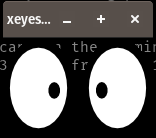

# Tutorial sobre configuración de un servidor ssh y administración de claves criptográficas  
En este tutorial guiado aprenderá como administrar de forma básica un servidor ssh y varias claves criptográficas en su computadora

## Configuración del contenedor docker
Primero creamos el contenedor ejecutando el siguiente comando dentro de la carpeta donde se encuentra el archivo ```compose.yaml```

```
docker compose up --build
```

Probamos conectarnos al contenedor usando el siguiente comando:

```
ssh root@localhost -p 2222
```
**Nota:** la contraseña es ```root```

Luego cerramos la conexión colocando ```exit```

## Administración básica de claves criptográficas ssh

Este es un paso esencial ya que las claves criptográficas son las herramientas que utiliza este protocolo para realizar la autenticación. Utilizar la misma clave para todos los servidores a los cuales nos conectamos no es lo adecuado, ya que si se compromete la seguridad de la clave privada comprometemos la seguridad de todos los servidores.

Ahora vamos a crear los pares de llaves públicas y privadas para conectarnos a distintos servidores:

Primero abrimos una nueva terminal **por facilidad es necesario estar en el directorio Home** caso contrario ejecutamos ```cd```

Comando para crear el par de claves:

```
ssh-keygen -t ed25519 -C "comentario-descriptivo"
```

las banderas ```-C``` y ```-t``` indican que se quiere agregar un comentario y se quiere indicar el tipo de clave.

### Ejemplo práctico:

```
xavier@pop-os:~$ ssh-keygen -t ed25519 -C "minitaller-ssh"
Generating public/private ed25519 key pair.
```
En el siguiente paso es importante especificar el archivo en el cual se quiere guardar la nueva clave, ya que no nos interesa sobreescribir las demás claves.

```
Enter file in which to save the key (/home/xavier/.ssh/id_ed25519): /home/xavier/.ssh/prueba-minitaller
```
Es importante agregar una frase para proteger la clave. Ya que si logran robar la clave privada, aun es necesario la frase para poder desencriptarla.

```
Enter passphrase (empty for no passphrase): 
Enter same passphrase again: 

```
Si todo fue bien, debería de salir algo así:

```
The key fingerprint is:
SHA256:9HXKucUVPf4dFjKgmFstJWOi0rg7f5PoRU2uBwv2tNg minitaller-ssh
The key's randomart image is:
+--[ED25519 256]--+
|       . + o.  ..|
|    o . = *  o oo|
|   o o o.= .. = +|
|    o  .*..o = = |
|   . o =So. + + +|
|    o B =    o  o|
|   o ..E..  .    |
|    o..+.        |
|    .o. .        |
+----[SHA256]-----+


```

Ahora vamos a copiar la clave al servidor de interés:
```
ssh-copy-id -i path-to-the-public-key -p 2222 root@localhost
```
Podemos usar la bandera ```-p``` para indicar el puerto.

### Ejemplo práctico

```
xavier@pop-os:~$ ssh-copy-id -p 2222 -i .ssh/prueba-minitaller.pub root@localhost
```
Si todo sale bien, nos tiene que salir algo como esto:

```
xavier@pop-os:~$ ssh-copy-id -p 2222 -i .ssh/prueba-minitaller.pub root@localhost
/usr/bin/ssh-copy-id: INFO: Source of key(s) to be installed: ".ssh/prueba-minitaller.pub"
/usr/bin/ssh-copy-id: INFO: attempting to log in with the new key(s), to filter out any that are already installed
/usr/bin/ssh-copy-id: INFO: 1 key(s) remain to be installed -- if you are prompted now it is to install the new keys
root@localhost's password: 

Number of key(s) added: 1

Now try logging into the machine, with:   "ssh -p '2222' 'root@localhost'"
and check to make sure that only the key(s) you wanted were added.
```
Ahora si probamos entrar usando ssh no nos debería pedir contraseña

```
xavier@pop-os:~$ ssh root@localhost -p 2222
Welcome to Ubuntu 22.04.5 LTS (GNU/Linux 6.12.10-76061203-generic x86_64)

 * Documentation:  https://help.ubuntu.com
 * Management:     https://landscape.canonical.com
 * Support:        https://ubuntu.com/pro

This system has been minimized by removing packages and content that are
not required on a system that users do not log into.

To restore this content, you can run the 'unminimize' command.
Last login: Wed Apr 30 00:53:51 2025 from 172.19.0.1
root@1ca64d5cff24:~# 

```

## Configuración básica de un servidor ssh

Hay ciertas cosas básicas que podemos configurar para que la computadora que queremos acceder de forma remota se encuentre lo más segura posible como son las siguientes:

- Cerrar puertos que no estén en uso
- Usar claves fuertes para los usuarios
- Evitar que una gran cantidad de usuarios tengan acceso root
- Habilitar un firewall

¿Ahora que hacemos si queremos acceder de forma remota a nuestra computadora? Tenemos que implementar ciertas configuraciones para poder realizar labores administrativas de forma efectiva sin que esto sea una vulnerabilidad para el servidor. Por eso es necesario implementar las siguientes buenas prácticas:

- Prevenir el acceso como root usando ssh
- Prevenir el acceso utilizando la contraseña de usuario
- Cambiar el puerto predeterminado

Empezamos iniciando sesión en el contenedor por medio de ssh usando el siguiente comando:

```
ssh root@localhost -p 2222
```
Notemos que ahora no nos solicita la contraseña

Dentro del contenedor vamos a crear un usuario ejecutando:
```
adduser user1
```
Lo que deberíamos ver:
```
root@1ca64d5cff24:~# adduser user1
Adding user `user1' ...
Adding new group `user1' (1001) ...
Adding new user `user1' (1001) with group `user1' ...
Creating home directory `/home/user1' ...
Copying files from `/etc/skel' ...
New password: 
Retype new password: 
passwd: password updated successfully
Changing the user information for user1
Enter the new value, or press ENTER for the default
	Full Name []: 
	Room Number []: 
	Work Phone []: 
	Home Phone []: 
	Other []: 
Is the information correct? [Y/n] y

```
como ejemplo usamos de contraseña ```1234```

Ahora nos salimos del servidor usando ```exit``` y nos conectamos como user1:
```
ssh user1@localhost -p 2222
```
**Note** que ahora se solicita contraseña, porque la clave que agregamos es para identificar al usuario ```root```

Nos salimos ```exit```

Ahora iniciemos como ```root```

Primero como buena práctica hacemos una copia del archivo ```sshd_config```

Nos dirigimos al siguiente directorio:
```
cd /etc/ssh
```
Vemos el contenido con ```ls```
```
root@1ca64d5cff24:/etc/ssh# ls
moduli        ssh_host_ecdsa_key      ssh_host_ed25519_key.pub  ssh_import_id
ssh_config    ssh_host_ecdsa_key.pub  ssh_host_rsa_key          sshd_config
ssh_config.d  ssh_host_ed25519_key    ssh_host_rsa_key.pub      sshd_config.d
```
Creamos un respaldo del archivo ```sshd_config```
```
cp sshd_config ./sshd_config.bak
```
Comprobamos con ```ls```
```
root@1ca64d5cff24:/etc/ssh# ls
moduli                  ssh_host_ed25519_key      sshd_config
ssh_config              ssh_host_ed25519_key.pub  sshd_config.bak
ssh_config.d            ssh_host_rsa_key          sshd_config.d
ssh_host_ecdsa_key      ssh_host_rsa_key.pub
ssh_host_ecdsa_key.pub  ssh_import_id
root@1ca64d5cff24:/etc/ssh# 

```

Vamos a desactivar el acceso con contraseña como primera medida de seguridad:

Entramos al archivo ```sshd_config```
```
nano sshd_config -l
```
Buscamos la línea 57 ```PasswordAuthentication yes -> no ``` guardamos y reseteamos el contenedor desde una terminal de la maquina host ejecutando lo siguiente:

```
docker restart ubuntu22-ssh
```
La conexión se tuvo que cerrar, ahora si probamos iniciar con ```user1``` vemos que nos impide la conexión:
```
xavier@pop-os:~$ ssh user1@localhost -p 2222
user1@localhost: Permission denied (publickey).
``` 
Para recuperar el acceso usando ```user1``` necesitamos agregar una llave pública al archivo ```/home/user1/.ssh/authorized_keys``` por simplicidad copiamos y pegamos la misma llave pública que creamos al inicio. Lo ideal sería crear una nueva.

Reseteamos el contenedor ```docker restart ubuntu22-ssh```

```
Welcome to Ubuntu 22.04.5 LTS (GNU/Linux 6.12.10-76061203-generic x86_64)

 * Documentation:  https://help.ubuntu.com
 * Management:     https://landscape.canonical.com
 * Support:        https://ubuntu.com/pro

This system has been minimized by removing packages and content that are
not required on a system that users do not log into.

To restore this content, you can run the 'unminimize' command.
Last login: Wed Apr 30 02:25:36 2025 from 172.19.0.1
user1@1ca64d5cff24:~$ 
```

Como podemos ver, recuperamos el acceso remoto con ese usuario.

Como última buena práctica bueno deshabilitar el inicio remoto como usuario ```root``` y asignar un usuario con capacidad de ```sudo```.

Antes de deshabilitar el acceso como root, es necesario agregar ```user1``` al grupo de ```sudoers```

Primero ingresamos como usuario ```root``` y una vez dentro, vamos a ejecutar: 
```
root@1ca64d5cff24:~# adduser user1 sudo
```
Si todo es correcto, tendríamos lo siguiente:
```
Adding user `user1' to group `sudo' ...
Adding user user1 to group sudo
Done.
```
Para comprobar el funcionamiento, iniciamos con ```user1``` y deshabilitamos el acceso con el usuario root línea 33 del archivo ```/etc/ssh/sshd_config```:
```
 PermitRootLogin no
```

Reiniciamos el contenedor ```docker restart ubuntu22-ssh```

Si intentamos iniciar como root, nos da el siguiente resultado aunque la llave esté autorizada:
```
xavier@pop-os:~$ ssh root@localhost -p 2222
root@localhost: Permission denied (publickey).
```
También podemos cambiar el puerto que utiliza ssh para conectarse modificando la siguiente línea del archivo ```sshd_config``` es necesario descomentar la línea y poner el puerto que uno desee. 

Hay que tener cuidado que no haya otra aplicación usando el mismo puerto

```
#Port 22
```
Si queremos correr una aplicación grafica en la computadora remota podemos hacer uso del redireccionamiento de x11.

Vemos que en este caso ya está habilitado el redireccionamiento de x11:
```
X11Forwarding yes
```

Usemos xeyes para probar:

Primero, cerramos la conexión y nos volvemos a conectar usando la bandera ```-X``` como se puede ver:
```
ssh user1@localhost -p 2222 -X
```
Dentro corremos el comando ```xeyes``` y nos debería aparecer la siguiente ventana:



Para ver más opciones y detalle de su uso puede consultar el manual de ```ssh``` usando el siguiente comando:

```
man ssh
```
